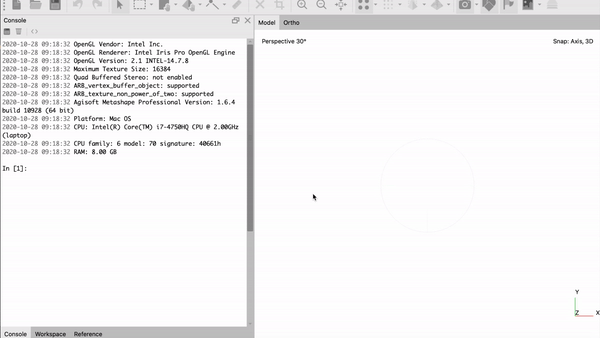

# Ocean Recovery Lab Scripts
Metashape Scripts to assist researchers at the Ocean Recoveries Lab at UC Santa Barbara.

## align_and_delete.py
**STEP 1**

align_and_delete will take a folder directory and loop through it's subfolders of separate coral treatments which consists of overlapping photos. This script will create a new chunk add and align photos, create tie points, estimate camera locations and delete all tie points outside bounding box. Then it will also delete pixels above a 0.5 reprojection error. Then this script will export these updated files to the user's designated location. 

### Instructions 
* Input 'mac' or 'windows' without quotation marks in the argument box based on which OS you are using
    * Program will guess the OS if no input given
* Select folder consisting of all the coral treatments
    * Make sure this folder only has subfolders that contain photos
* Select folder where you would like to place all the updated coral treatments

## opt_and_build.py
**STEP 2**

opt_and_build will be called after the user defines points and set scale bar distance. This script will optimize cameras, delete other points outside bounding box, build dense cloud, then delete more pixels above a 0.5 reprojection error. Then it will repeat this process for all coral treatments.

### Instructions
* Input 'mac' or 'windows' without quotation marks in the argument box based on which OS you are using
    * Program will guess the OS if no input given
* Select folder consisting of updated coral treatments that was made from align_and_delete.py
    * This folder should have the metashape files in it
* Select folder where you would like to place all the updated coral treatments

## logging

logs will be generated for debugging and are located in the same folder as these python scripts.